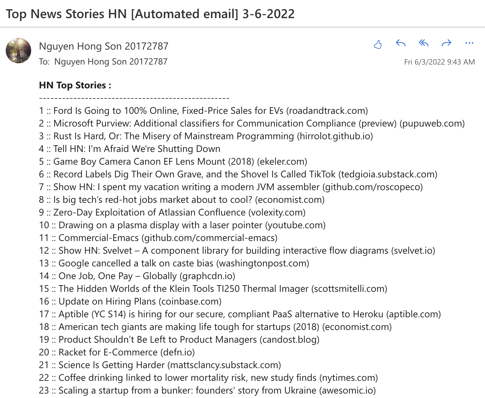

# Automated Email Sender

## Description

In this project, we'll learn how to build an email sender that automatically send an mail from this email address to another (or others). The email structure will be built step by step that you can easily find it from the source code. Although this project is kind of simple at first, I think it should be helpful, extendable and a good starter when you want to develop this tool later on.

## Installation

`pip install -r /path/to/requirements.txt`

## Instructions

URL: https://news.ycombinator.com/
To run this program, open a terminal and type the command `./run.sh` and then enter

## General steps

1. GET request
2. Use BeautifulSoup (web scraping)
3. Buil email content
4. Authenticate emails

## Demonstration

## Note

- This project is using less secure technology. It means it doesn't utilize 2-factor authentication so you need to turn less secure technology on before running the program
-  When inspecting an url, you need to know that a `table` tag contains many rows (`tr`) and each row (`tr`) comprises many cells (`td`) 

## Lessons learned

- How to scrape a website
- How to extract the components we want
- How to build an email components
- How to automatically send that content from this email address to others
- How to automate python code by bash scripts

